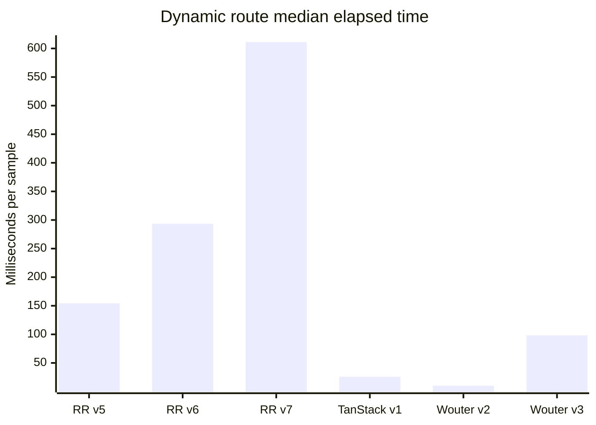
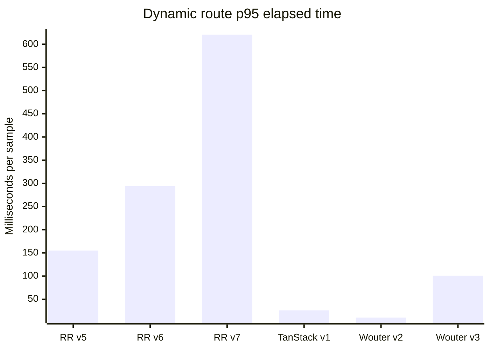
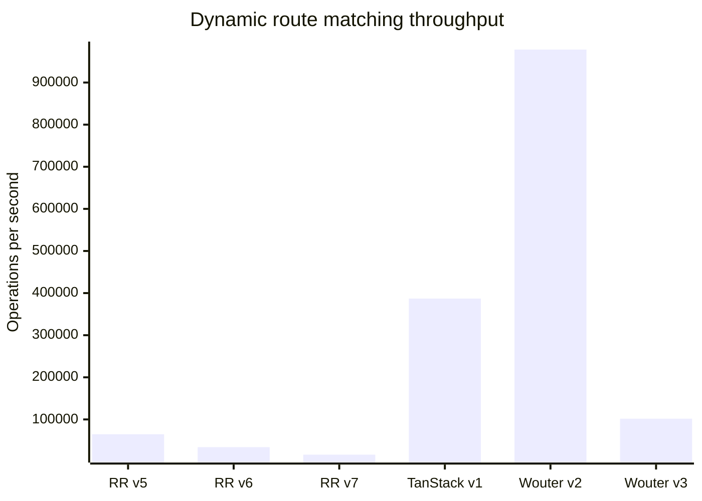

# Benchmark for React Routers

A reproducible route-matching benchmark for several generations of popular
React routers. Package aliases allow incompatible major versions to be
installed together and selected from the command line.

## Included routers

The versions below were refreshed on **October 1, 2026**.

| Benchmark ID | Package | Version | Why it is included |
| --- | --- | ---: | --- |
| `react-router-v5` | [`react-router`](https://v5.reactrouter.com/) | 5.3.4 | Last v5 release |
| `react-router-v6` | [`react-router`](https://reactrouter.com/) | 6.30.6 | Maintained v6 line |
| `react-router-v7` | [`react-router`](https://reactrouter.com/) | 7.18.4 | Current release |
| `tanstack-router-v1` | [`@tanstack/react-router`](https://tanstack.com/router/latest) | 1.170.41 | Current release |
| `wouter-v2` | [`wouter`](https://github.com/molefrog/wouter) | 2.12.1 | Previous major for comparison |
| `wouter-v3` | [`wouter`](https://github.com/molefrog/wouter) | 3.13.0 | Current release |

Versions are pinned (rather than ranged) so results from a checkout remain
repeatable. To refresh them, update the npm aliases in `package.json`, run
`npm install`, and update this table.

## What is measured

Every adapter receives the same 27-route table: 26 static routes (`/a` through
`/z`) and one dynamic route (`/users/:userId`). The benchmark measures the
router's public matching API for:

* first, middle, and last static routes;
* a dynamic route with a parameter; and
* a missing route.

Each result reports the median and p95 elapsed time for a batch, plus operations
per second derived from the median. Warm-up iterations run before timing. This
tests route matching only—not React rendering, data loading, browser history,
or complete navigation. The libraries expose different matching abstractions,
so use the numbers as a focused comparison rather than a complete router
ranking.

## Requirements and setup

Node.js 20.19 or newer is required by the current TanStack Router release.

```bash
npm ci
npm test
```

The GitHub Actions workflow runs the test suite and a small benchmark smoke test
against both the minimum supported Node.js release and the current Node.js 22
line. The smoke test exercises every router/scenario combination and validates
the generated JSON, but deliberately avoids treating shared CI runner timings
as stable performance measurements.

## Running benchmarks

Run the full router and scenario matrix:

```bash
npm run benchmark
```

List all selectable router IDs and scenarios:

```bash
npm run list
```

Select any combination of versions and scenarios:

```bash
npm run benchmark -- \
  --routers react-router-v6,react-router-v7,tanstack-router-v1 \
  --scenarios static-last,dynamic,not-found \
  --runs 25000 \
  --samples 7
```

Machine-readable output is available with `--format json` or `--format csv`.
Use `--warmup` to change the warm-up count; `--help` documents every option.

For less noisy comparisons, close other CPU-heavy programs, keep the Node.js
version and power settings fixed, and run multiple benchmark processes.

## Automated benchmark results

The repository owner can manually start the [full benchmark
workflow](./.github/workflows/benchmark.yml). It commits the complete JSON
output to the [`benchmark-results` directory](./benchmark-results/) with the
UTC date and time in the file name, then refreshes the link below. Runs started
by any other actor are skipped.

<!-- benchmark-results:start -->
Latest automated result: [`benchmark-2026-10-02T02-15-11Z.json`](./benchmark-results/benchmark-2026-10-02T02-15-11Z.json) (generated 2026-10-02T02-15-11Z UTC).

The charts show every metric captured for dynamic-route matching. Lower is better for elapsed times; higher is better for throughput.
Chart labels are shortened for readability; `RR` means React Router, and the complete router IDs appear in the table.







### Complete results

All captured metrics are shown below. Times are for one complete sample of the configured number of runs.

| Router | Package version | Scenario | Routes | Runs / sample | Samples | Median (ms) | p95 (ms) | Operations / second |
| --- | --- | --- | ---: | ---: | ---: | ---: | ---: | ---: |
| `react-router-v5` | `react-router@5.3.4` | `static-first` | 27 | 10,000 | 5 | 6.604 | 7.655 | 1,514,192 |
| `react-router-v5` | `react-router@5.3.4` | `static-middle` | 27 | 10,000 | 5 | 74.641 | 108.387 | 133,974 |
| `react-router-v5` | `react-router@5.3.4` | `static-last` | 27 | 10,000 | 5 | 149.458 | 151.699 | 66,909 |
| `react-router-v5` | `react-router@5.3.4` | `dynamic` | 27 | 10,000 | 5 | 154.314 | 155.152 | 64,803 |
| `react-router-v5` | `react-router@5.3.4` | `not-found` | 27 | 10,000 | 5 | 153.831 | 154.047 | 65,007 |
| `react-router-v6` | `react-router@6.30.6` | `static-first` | 27 | 10,000 | 5 | 300.715 | 304.092 | 33,254 |
| `react-router-v6` | `react-router@6.30.6` | `static-middle` | 27 | 10,000 | 5 | 405.047 | 410.443 | 24,689 |
| `react-router-v6` | `react-router@6.30.6` | `static-last` | 27 | 10,000 | 5 | 493.887 | 499.703 | 20,248 |
| `react-router-v6` | `react-router@6.30.6` | `dynamic` | 27 | 10,000 | 5 | 293.396 | 293.838 | 34,084 |
| `react-router-v6` | `react-router@6.30.6` | `not-found` | 27 | 10,000 | 5 | 481.52 | 482.17 | 20,768 |
| `react-router-v7` | `react-router@7.18.4` | `static-first` | 27 | 10,000 | 5 | 606.237 | 607.485 | 16,495 |
| `react-router-v7` | `react-router@7.18.4` | `static-middle` | 27 | 10,000 | 5 | 614.821 | 615.32 | 16,265 |
| `react-router-v7` | `react-router@7.18.4` | `static-last` | 27 | 10,000 | 5 | 623.71 | 675.641 | 16,033 |
| `react-router-v7` | `react-router@7.18.4` | `dynamic` | 27 | 10,000 | 5 | 611.264 | 620.766 | 16,360 |
| `react-router-v7` | `react-router@7.18.4` | `not-found` | 27 | 10,000 | 5 | 617.968 | 618.983 | 16,182 |
| `tanstack-router-v1` | `@tanstack/react-router@1.170.41` | `static-first` | 27 | 10,000 | 5 | 12.316 | 12.497 | 811,928 |
| `tanstack-router-v1` | `@tanstack/react-router@1.170.41` | `static-middle` | 27 | 10,000 | 5 | 12.489 | 12.651 | 800,687 |
| `tanstack-router-v1` | `@tanstack/react-router@1.170.41` | `static-last` | 27 | 10,000 | 5 | 12.436 | 12.503 | 804,124 |
| `tanstack-router-v1` | `@tanstack/react-router@1.170.41` | `dynamic` | 27 | 10,000 | 5 | 25.842 | 25.989 | 386,968 |
| `tanstack-router-v1` | `@tanstack/react-router@1.170.41` | `not-found` | 27 | 10,000 | 5 | 6.306 | 6.807 | 1,585,876 |
| `wouter-v2` | `wouter@2.12.1` | `static-first` | 27 | 10,000 | 5 | 0.417 | 0.626 | 23,965,011 |
| `wouter-v2` | `wouter@2.12.1` | `static-middle` | 27 | 10,000 | 5 | 3.663 | 3.702 | 2,729,938 |
| `wouter-v2` | `wouter@2.12.1` | `static-last` | 27 | 10,000 | 5 | 8.908 | 9.181 | 1,122,624 |
| `wouter-v2` | `wouter@2.12.1` | `dynamic` | 27 | 10,000 | 5 | 10.221 | 10.43 | 978,356 |
| `wouter-v2` | `wouter@2.12.1` | `not-found` | 27 | 10,000 | 5 | 8.6 | 8.768 | 1,162,819 |
| `wouter-v3` | `wouter@3.13.0` | `static-first` | 27 | 10,000 | 5 | 3.507 | 3.672 | 2,851,038 |
| `wouter-v3` | `wouter@3.13.0` | `static-middle` | 27 | 10,000 | 5 | 48.822 | 49.097 | 204,826 |
| `wouter-v3` | `wouter@3.13.0` | `static-last` | 27 | 10,000 | 5 | 91.626 | 98.688 | 109,140 |
| `wouter-v3` | `wouter@3.13.0` | `dynamic` | 27 | 10,000 | 5 | 98.308 | 100.818 | 101,721 |
| `wouter-v3` | `wouter@3.13.0` | `not-found` | 27 | 10,000 | 5 | 94.146 | 95.15 | 106,218 |
<!-- benchmark-results:end -->
