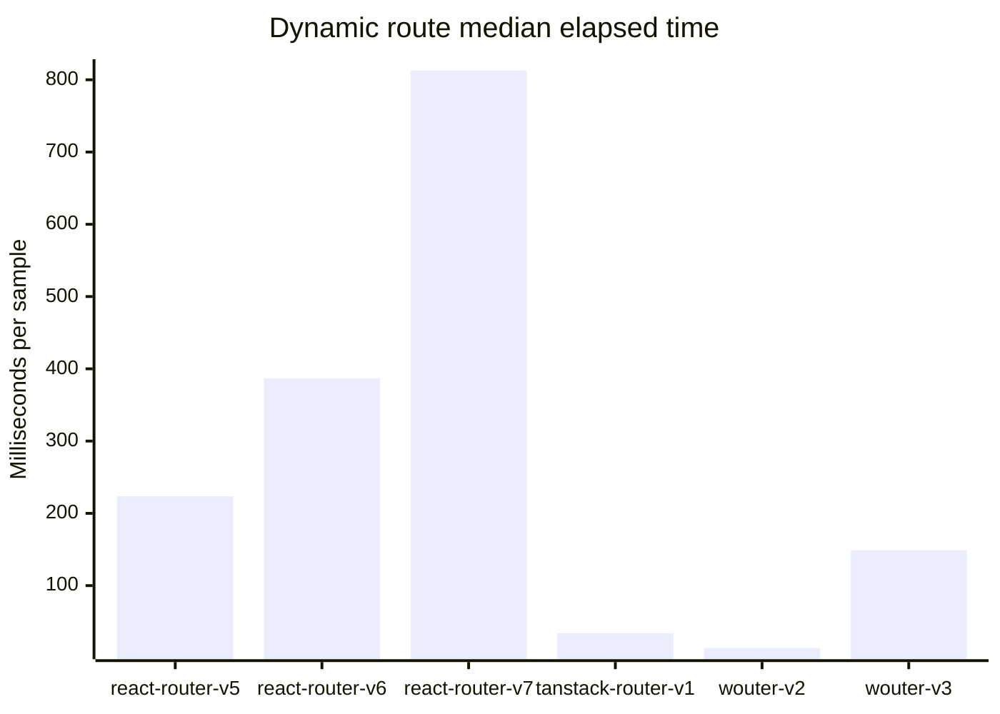
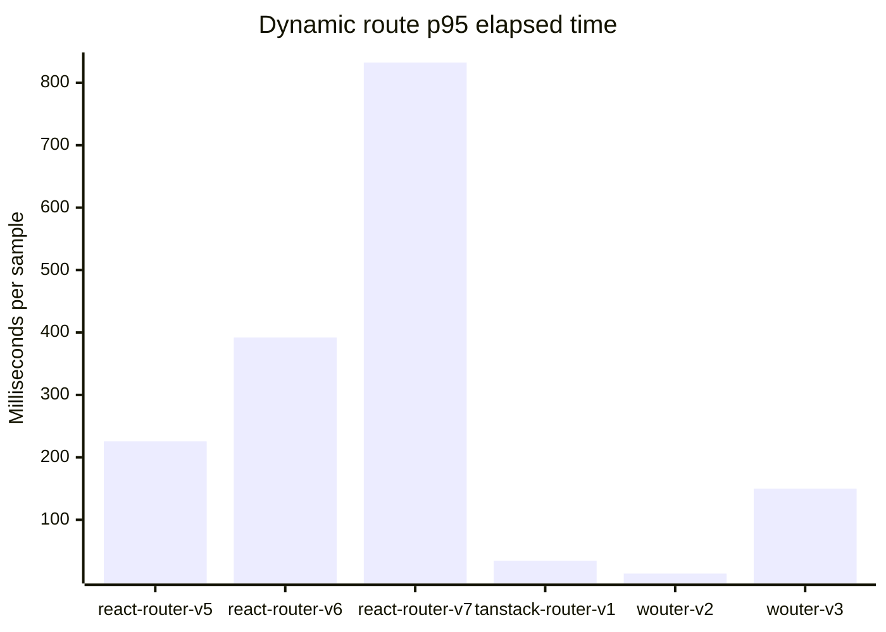
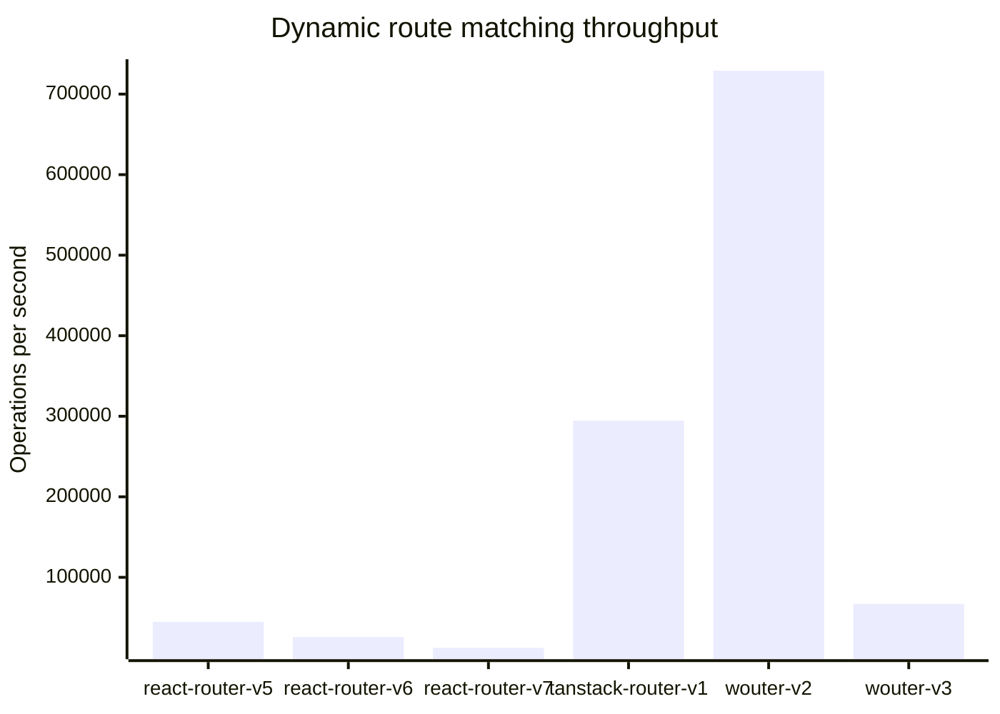

# Benchmark for React Routers

A reproducible route-matching benchmark for several generations of popular
React routers. Package aliases allow incompatible major versions to be
installed together and selected from the command line.

## Included routers

The versions below were refreshed on **October 1, 2026**.

| Benchmark ID | Package | Version | Why it is included |
| --- | --- | ---: | --- |
| `react-router-v5` | [`react-router`](https://v5.reactrouter.com/) | 5.3.4 | Last v5 release |
| `react-router-v6` | [`react-router`](https://reactrouter.com/) | 6.30.6 | Maintained v6 line |
| `react-router-v7` | [`react-router`](https://reactrouter.com/) | 7.18.4 | Current release |
| `tanstack-router-v1` | [`@tanstack/react-router`](https://tanstack.com/router/latest) | 1.170.41 | Current release |
| `wouter-v2` | [`wouter`](https://github.com/molefrog/wouter) | 2.12.1 | Previous major for comparison |
| `wouter-v3` | [`wouter`](https://github.com/molefrog/wouter) | 3.13.0 | Current release |

Versions are pinned (rather than ranged) so results from a checkout remain
repeatable. To refresh them, update the npm aliases in `package.json`, run
`npm install`, and update this table.

## What is measured

Every adapter receives the same 27-route table: 26 static routes (`/a` through
`/z`) and one dynamic route (`/users/:userId`). The benchmark measures the
router's public matching API for:

* first, middle, and last static routes;
* a dynamic route with a parameter; and
* a missing route.

Each result reports the median and p95 elapsed time for a batch, plus operations
per second derived from the median. Warm-up iterations run before timing. This
tests route matching only—not React rendering, data loading, browser history,
or complete navigation. The libraries expose different matching abstractions,
so use the numbers as a focused comparison rather than a complete router
ranking.

## Requirements and setup

Node.js 20.19 or newer is required by the current TanStack Router release.

```bash
npm ci
npm test
```

The GitHub Actions workflow runs the test suite and a small benchmark smoke test
against both the minimum supported Node.js release and the current Node.js 22
line. The smoke test exercises every router/scenario combination and validates
the generated JSON, but deliberately avoids treating shared CI runner timings
as stable performance measurements.

## Running benchmarks

Run the full router and scenario matrix:

```bash
npm run benchmark
```

List all selectable router IDs and scenarios:

```bash
npm run list
```

Select any combination of versions and scenarios:

```bash
npm run benchmark -- \
  --routers react-router-v6,react-router-v7,tanstack-router-v1 \
  --scenarios static-last,dynamic,not-found \
  --runs 25000 \
  --samples 7
```

Machine-readable output is available with `--format json` or `--format csv`.
Use `--warmup` to change the warm-up count; `--help` documents every option.

For less noisy comparisons, close other CPU-heavy programs, keep the Node.js
version and power settings fixed, and run multiple benchmark processes.

## Automated benchmark results

The repository owner can manually start the [full benchmark
workflow](./.github/workflows/benchmark.yml). It commits the complete JSON
output to the [`benchmark-results` directory](./benchmark-results/) with the
UTC date and time in the file name, then refreshes the link below. Runs started
by any other actor are skipped.

<!-- benchmark-results:start -->
Latest automated result: [`benchmark-2026-10-01T23-38-57Z.json`](./benchmark-results/benchmark-2026-10-01T23-38-57Z.json) (generated 2026-10-01T23-38-57Z UTC).

The charts show every metric captured for dynamic-route matching. Lower is better for elapsed times; higher is better for throughput.







### Complete results

All captured metrics are shown below. Times are for one complete sample of the configured number of runs.

| Router | Package version | Scenario | Routes | Runs / sample | Samples | Median (ms) | p95 (ms) | Operations / second |
| --- | --- | --- | ---: | ---: | ---: | ---: | ---: | ---: |
| `react-router-v5` | `react-router@5.3.4` | `static-first` | 27 | 10,000 | 5 | 10.056 | 10.708 | 994,416 |
| `react-router-v5` | `react-router@5.3.4` | `static-middle` | 27 | 10,000 | 5 | 107.295 | 111.317 | 93,201 |
| `react-router-v5` | `react-router@5.3.4` | `static-last` | 27 | 10,000 | 5 | 213.325 | 223.392 | 46,877 |
| `react-router-v5` | `react-router@5.3.4` | `dynamic` | 27 | 10,000 | 5 | 223.617 | 225.628 | 44,719 |
| `react-router-v5` | `react-router@5.3.4` | `not-found` | 27 | 10,000 | 5 | 220.717 | 255.894 | 45,307 |
| `react-router-v6` | `react-router@6.30.6` | `static-first` | 27 | 10,000 | 5 | 401.328 | 404.284 | 24,917 |
| `react-router-v6` | `react-router@6.30.6` | `static-middle` | 27 | 10,000 | 5 | 528.423 | 531.779 | 18,924 |
| `react-router-v6` | `react-router@6.30.6` | `static-last` | 27 | 10,000 | 5 | 662.695 | 663.961 | 15,090 |
| `react-router-v6` | `react-router@6.30.6` | `dynamic` | 27 | 10,000 | 5 | 387.001 | 392.058 | 25,840 |
| `react-router-v6` | `react-router@6.30.6` | `not-found` | 27 | 10,000 | 5 | 652.682 | 655.847 | 15,321 |
| `react-router-v7` | `react-router@7.18.4` | `static-first` | 27 | 10,000 | 5 | 801.26 | 803.026 | 12,480 |
| `react-router-v7` | `react-router@7.18.4` | `static-middle` | 27 | 10,000 | 5 | 811.714 | 862.337 | 12,320 |
| `react-router-v7` | `react-router@7.18.4` | `static-last` | 27 | 10,000 | 5 | 824.048 | 826.441 | 12,135 |
| `react-router-v7` | `react-router@7.18.4` | `dynamic` | 27 | 10,000 | 5 | 812.703 | 832.505 | 12,305 |
| `react-router-v7` | `react-router@7.18.4` | `not-found` | 27 | 10,000 | 5 | 817.814 | 824.122 | 12,228 |
| `tanstack-router-v1` | `@tanstack/react-router@1.170.41` | `static-first` | 27 | 10,000 | 5 | 16.426 | 16.803 | 608,773 |
| `tanstack-router-v1` | `@tanstack/react-router@1.170.41` | `static-middle` | 27 | 10,000 | 5 | 16.532 | 16.685 | 604,896 |
| `tanstack-router-v1` | `@tanstack/react-router@1.170.41` | `static-last` | 27 | 10,000 | 5 | 16.57 | 16.757 | 603,516 |
| `tanstack-router-v1` | `@tanstack/react-router@1.170.41` | `dynamic` | 27 | 10,000 | 5 | 33.962 | 34.233 | 294,448 |
| `tanstack-router-v1` | `@tanstack/react-router@1.170.41` | `not-found` | 27 | 10,000 | 5 | 8.514 | 8.7 | 1,174,515 |
| `wouter-v2` | `wouter@2.12.1` | `static-first` | 27 | 10,000 | 5 | 0.526 | 1.205 | 19,009,455 |
| `wouter-v2` | `wouter@2.12.1` | `static-middle` | 27 | 10,000 | 5 | 4.663 | 4.713 | 2,144,325 |
| `wouter-v2` | `wouter@2.12.1` | `static-last` | 27 | 10,000 | 5 | 12.438 | 12.565 | 803,985 |
| `wouter-v2` | `wouter@2.12.1` | `dynamic` | 27 | 10,000 | 5 | 13.714 | 13.874 | 729,207 |
| `wouter-v2` | `wouter@2.12.1` | `not-found` | 27 | 10,000 | 5 | 11.979 | 12.219 | 834,811 |
| `wouter-v3` | `wouter@3.13.0` | `static-first` | 27 | 10,000 | 5 | 5.29 | 5.495 | 1,890,401 |
| `wouter-v3` | `wouter@3.13.0` | `static-middle` | 27 | 10,000 | 5 | 67.961 | 68.136 | 147,142 |
| `wouter-v3` | `wouter@3.13.0` | `static-last` | 27 | 10,000 | 5 | 136.13 | 136.73 | 73,459 |
| `wouter-v3` | `wouter@3.13.0` | `dynamic` | 27 | 10,000 | 5 | 148.875 | 149.774 | 67,170 |
| `wouter-v3` | `wouter@3.13.0` | `not-found` | 27 | 10,000 | 5 | 144.575 | 145.406 | 69,168 |
<!-- benchmark-results:end -->
