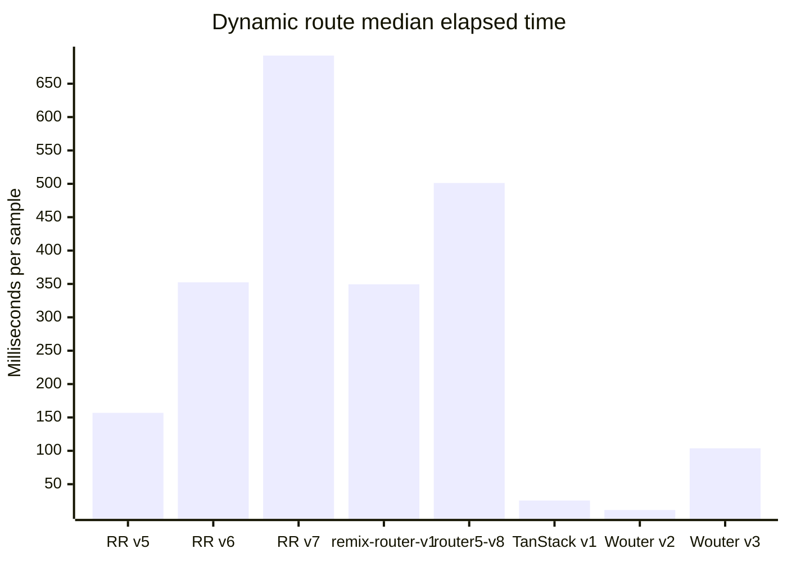
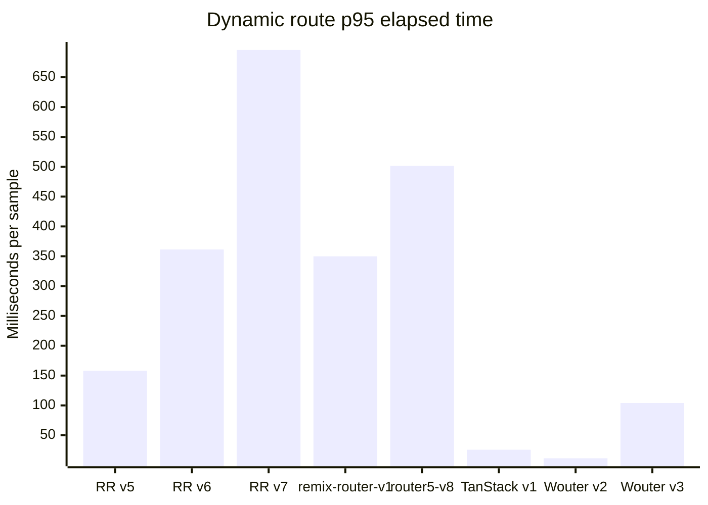
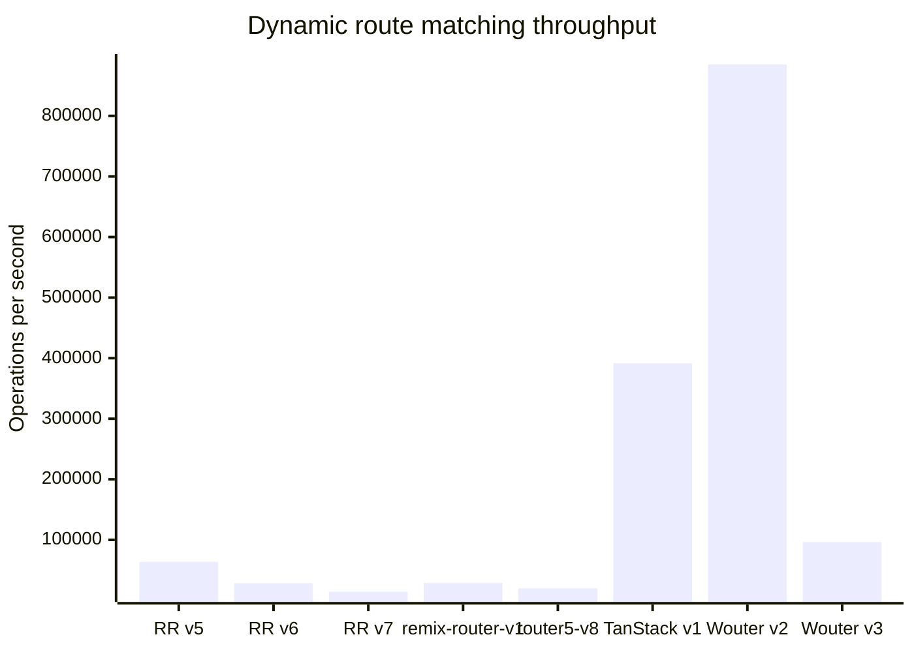

# Benchmark for React Routers

A reproducible route-matching benchmark for several generations of popular
React routers and routing engines commonly used by React applications. Package
aliases allow incompatible major versions to be installed together and
selected from the command line.

## Included routers

The versions below were refreshed on **October 2, 2026**.

| Benchmark ID | Package | Version | Why it is included |
| --- | --- | ---: | --- |
| `react-router-v5` | [`react-router`](https://v5.reactrouter.com/) | 5.3.4 | Last v5 release |
| `react-router-v6` | [`react-router`](https://reactrouter.com/) | 6.30.6 | Maintained v6 line |
| `react-router-v7` | [`react-router`](https://reactrouter.com/) | 7.18.4 | Current release |
| `remix-router-v1` | [`@remix-run/router`](https://github.com/remix-run/react-router/tree/main/packages/react-router) | 1.23.4 | Framework-independent engine behind React Router 6 |
| `router5-v8` | [`router5`](https://router5.js.org/) | 8.0.1 | Framework-independent router with React bindings |
| `tanstack-router-v1` | [`@tanstack/react-router`](https://tanstack.com/router/latest) | 1.170.41 | Current release |
| `wouter-v2` | [`wouter`](https://github.com/molefrog/wouter) | 2.12.1 | Previous major for comparison |
| `wouter-v3` | [`wouter`](https://github.com/molefrog/wouter) | 3.13.0 | Current release |

Versions are pinned (rather than ranged) so results from a checkout remain
repeatable. To refresh them, update the npm aliases in `package.json`, run
`npm install`, and update this table.

## What is measured

Every adapter receives the same 30-route table: 26 static routes (`/a` through
`/z`), a deeply nested static route, a single-parameter route, a
multiple-parameter route, and a wildcard route. Adapter-specific syntax is
used where libraries spell parameters or wildcards differently. The benchmark
measures the router's public matching API for:

* first, middle, and last static routes;
* a deeply nested static route;
* dynamic routes with one and multiple parameters;
* a multi-segment wildcard;
* a partial dynamic-route near miss; and
* a completely missing route.

Each result reports the median and p95 elapsed time for a batch, plus operations
per second derived from the median. Warm-up iterations run before timing. This
tests route matching only—not React rendering, data loading, browser history,
or complete navigation. The libraries expose different matching abstractions,
so use the numbers as a focused comparison rather than a complete router
ranking.

## Requirements and setup

Node.js 20.19 or newer is required by the current TanStack Router release.

```bash
npm ci
npm test
```

The GitHub Actions workflow runs the test suite and a small benchmark smoke test
against both the minimum supported Node.js release and the current Node.js 22
line. The smoke test exercises every router/scenario combination and validates
the generated JSON, but deliberately avoids treating shared CI runner timings
as stable performance measurements.

## Running benchmarks

Run the full router and scenario matrix:

```bash
npm run benchmark
```

List all selectable router IDs and scenarios:

```bash
npm run list
```

Select any combination of versions and scenarios:

```bash
npm run benchmark -- \
  --routers react-router-v6,react-router-v7,tanstack-router-v1 \
  --scenarios static-last,dynamic,not-found \
  --runs 25000 \
  --samples 7
```

Machine-readable output is available with `--format json` or `--format csv`.
Use `--warmup` to change the warm-up count; `--help` documents every option.

For less noisy comparisons, close other CPU-heavy programs, keep the Node.js
version and power settings fixed, and run multiple benchmark processes.

## Automated benchmark results

The repository owner can manually start the [full benchmark
workflow](./.github/workflows/benchmark.yml). It commits the complete JSON
output to the [`benchmark-results` directory](./benchmark-results/) with the
UTC date and time in the file name, then refreshes the link below. Runs started
by any other actor are skipped.

<!-- benchmark-results:start -->
Latest automated result: [`benchmark-2026-10-02T03-07-35Z.json`](./benchmark-results/benchmark-2026-10-02T03-07-35Z.json) (generated 2026-10-02T03-07-35Z UTC).

The charts show every metric captured for dynamic-route matching. Lower is better for elapsed times; higher is better for throughput.
Chart labels are shortened for readability; `RR` means React Router, and the complete router IDs appear in the table.







### Complete results

All captured metrics are shown below. Times are for one complete sample of the configured number of runs.

| Router | Package version | Scenario | Routes | Runs / sample | Samples | Median (ms) | p95 (ms) | Operations / second |
| --- | --- | --- | ---: | ---: | ---: | ---: | ---: | ---: |
| `react-router-v5` | `react-router@5.3.4` | `static-first` | 30 | 10,000 | 5 | 6.517 | 6.678 | 1,534,338 |
| `react-router-v5` | `react-router@5.3.4` | `static-middle` | 30 | 10,000 | 5 | 71.857 | 76.046 | 139,165 |
| `react-router-v5` | `react-router@5.3.4` | `static-last` | 30 | 10,000 | 5 | 146.974 | 148.181 | 68,039 |
| `react-router-v5` | `react-router@5.3.4` | `nested-static` | 30 | 10,000 | 5 | 152.138 | 152.705 | 65,730 |
| `react-router-v5` | `react-router@5.3.4` | `dynamic` | 30 | 10,000 | 5 | 156.907 | 158.256 | 63,732 |
| `react-router-v5` | `react-router@5.3.4` | `dynamic-multiple` | 30 | 10,000 | 5 | 163.628 | 167.658 | 61,114 |
| `react-router-v5` | `react-router@5.3.4` | `wildcard` | 30 | 10,000 | 5 | 172.916 | 173.149 | 57,831 |
| `react-router-v5` | `react-router@5.3.4` | `near-miss` | 30 | 10,000 | 5 | 170.414 | 170.633 | 58,681 |
| `react-router-v5` | `react-router@5.3.4` | `not-found` | 30 | 10,000 | 5 | 170.049 | 170.338 | 58,807 |
| `react-router-v6` | `react-router@6.30.6` | `static-first` | 30 | 10,000 | 5 | 357.668 | 367.779 | 27,959 |
| `react-router-v6` | `react-router@6.30.6` | `static-middle` | 30 | 10,000 | 5 | 458.9 | 463.126 | 21,791 |
| `react-router-v6` | `react-router@6.30.6` | `static-last` | 30 | 10,000 | 5 | 554.628 | 554.942 | 18,030 |
| `react-router-v6` | `react-router@6.30.6` | `nested-static` | 30 | 10,000 | 5 | 328.37 | 329.201 | 30,453 |
| `react-router-v6` | `react-router@6.30.6` | `dynamic` | 30 | 10,000 | 5 | 352.453 | 361.367 | 28,373 |
| `react-router-v6` | `react-router@6.30.6` | `dynamic-multiple` | 30 | 10,000 | 5 | 347.802 | 348.403 | 28,752 |
| `react-router-v6` | `react-router@6.30.6` | `wildcard` | 30 | 10,000 | 5 | 571.176 | 572.099 | 17,508 |
| `react-router-v6` | `react-router@6.30.6` | `near-miss` | 30 | 10,000 | 5 | 555.223 | 556.224 | 18,011 |
| `react-router-v6` | `react-router@6.30.6` | `not-found` | 30 | 10,000 | 5 | 551.433 | 551.938 | 18,135 |
| `react-router-v7` | `react-router@7.18.4` | `static-first` | 30 | 10,000 | 5 | 687.978 | 703.577 | 14,535 |
| `react-router-v7` | `react-router@7.18.4` | `static-middle` | 30 | 10,000 | 5 | 695.943 | 705.104 | 14,369 |
| `react-router-v7` | `react-router@7.18.4` | `static-last` | 30 | 10,000 | 5 | 703.494 | 708.271 | 14,215 |
| `react-router-v7` | `react-router@7.18.4` | `nested-static` | 30 | 10,000 | 5 | 690.946 | 692.008 | 14,473 |
| `react-router-v7` | `react-router@7.18.4` | `dynamic` | 30 | 10,000 | 5 | 692.15 | 695.838 | 14,448 |
| `react-router-v7` | `react-router@7.18.4` | `dynamic-multiple` | 30 | 10,000 | 5 | 698.88 | 701.879 | 14,309 |
| `react-router-v7` | `react-router@7.18.4` | `wildcard` | 30 | 10,000 | 5 | 713.987 | 715.076 | 14,006 |
| `react-router-v7` | `react-router@7.18.4` | `near-miss` | 30 | 10,000 | 5 | 702.092 | 702.68 | 14,243 |
| `react-router-v7` | `react-router@7.18.4` | `not-found` | 30 | 10,000 | 5 | 700.227 | 700.949 | 14,281 |
| `remix-router-v1` | `@remix-run/router@1.23.4` | `static-first` | 30 | 10,000 | 5 | 351.284 | 352.445 | 28,467 |
| `remix-router-v1` | `@remix-run/router@1.23.4` | `static-middle` | 30 | 10,000 | 5 | 444.17 | 444.94 | 22,514 |
| `remix-router-v1` | `@remix-run/router@1.23.4` | `static-last` | 30 | 10,000 | 5 | 543.464 | 543.846 | 18,400 |
| `remix-router-v1` | `@remix-run/router@1.23.4` | `nested-static` | 30 | 10,000 | 5 | 323.066 | 323.364 | 30,953 |
| `remix-router-v1` | `@remix-run/router@1.23.4` | `dynamic` | 30 | 10,000 | 5 | 349.462 | 349.948 | 28,615 |
| `remix-router-v1` | `@remix-run/router@1.23.4` | `dynamic-multiple` | 30 | 10,000 | 5 | 345.659 | 347.442 | 28,930 |
| `remix-router-v1` | `@remix-run/router@1.23.4` | `wildcard` | 30 | 10,000 | 5 | 566.202 | 567.278 | 17,662 |
| `remix-router-v1` | `@remix-run/router@1.23.4` | `near-miss` | 30 | 10,000 | 5 | 550.129 | 550.299 | 18,178 |
| `remix-router-v1` | `@remix-run/router@1.23.4` | `not-found` | 30 | 10,000 | 5 | 546.671 | 547.073 | 18,293 |
| `router5-v8` | `router5@8.0.1` | `static-first` | 30 | 10,000 | 5 | 484.001 | 484.674 | 20,661 |
| `router5-v8` | `router5@8.0.1` | `static-middle` | 30 | 10,000 | 5 | 566.082 | 568.894 | 17,665 |
| `router5-v8` | `router5@8.0.1` | `static-last` | 30 | 10,000 | 5 | 653.49 | 654.477 | 15,302 |
| `router5-v8` | `router5@8.0.1` | `nested-static` | 30 | 10,000 | 5 | 477.819 | 478.147 | 20,928 |
| `router5-v8` | `router5@8.0.1` | `dynamic` | 30 | 10,000 | 5 | 501.257 | 501.482 | 19,950 |
| `router5-v8` | `router5@8.0.1` | `dynamic-multiple` | 30 | 10,000 | 5 | 515.271 | 516.254 | 19,407 |
| `router5-v8` | `router5@8.0.1` | `wildcard` | 30 | 10,000 | 5 | 719.555 | 722.307 | 13,897 |
| `router5-v8` | `router5@8.0.1` | `near-miss` | 30 | 10,000 | 5 | 642.435 | 643.918 | 15,566 |
| `router5-v8` | `router5@8.0.1` | `not-found` | 30 | 10,000 | 5 | 641.79 | 642.304 | 15,581 |
| `tanstack-router-v1` | `@tanstack/react-router@1.170.41` | `static-first` | 30 | 10,000 | 5 | 12.159 | 12.342 | 822,437 |
| `tanstack-router-v1` | `@tanstack/react-router@1.170.41` | `static-middle` | 30 | 10,000 | 5 | 12.358 | 12.541 | 809,191 |
| `tanstack-router-v1` | `@tanstack/react-router@1.170.41` | `static-last` | 30 | 10,000 | 5 | 12.236 | 12.457 | 817,264 |
| `tanstack-router-v1` | `@tanstack/react-router@1.170.41` | `nested-static` | 30 | 10,000 | 5 | 13.506 | 13.608 | 740,416 |
| `tanstack-router-v1` | `@tanstack/react-router@1.170.41` | `dynamic` | 30 | 10,000 | 5 | 25.538 | 25.704 | 391,571 |
| `tanstack-router-v1` | `@tanstack/react-router@1.170.41` | `dynamic-multiple` | 30 | 10,000 | 5 | 21.332 | 21.457 | 468,785 |
| `tanstack-router-v1` | `@tanstack/react-router@1.170.41` | `wildcard` | 30 | 10,000 | 5 | 19.698 | 19.881 | 507,668 |
| `tanstack-router-v1` | `@tanstack/react-router@1.170.41` | `near-miss` | 30 | 10,000 | 5 | 6.32 | 6.417 | 1,582,163 |
| `tanstack-router-v1` | `@tanstack/react-router@1.170.41` | `not-found` | 30 | 10,000 | 5 | 6.327 | 6.364 | 1,580,552 |
| `wouter-v2` | `wouter@2.12.1` | `static-first` | 30 | 10,000 | 5 | 0.411 | 0.774 | 24,341,620 |
| `wouter-v2` | `wouter@2.12.1` | `static-middle` | 30 | 10,000 | 5 | 3.997 | 4.313 | 2,501,838 |
| `wouter-v2` | `wouter@2.12.1` | `static-last` | 30 | 10,000 | 5 | 10.048 | 10.144 | 995,191 |
| `wouter-v2` | `wouter@2.12.1` | `nested-static` | 30 | 10,000 | 5 | 10.422 | 10.557 | 959,495 |
| `wouter-v2` | `wouter@2.12.1` | `dynamic` | 30 | 10,000 | 5 | 11.301 | 11.382 | 884,899 |
| `wouter-v2` | `wouter@2.12.1` | `dynamic-multiple` | 30 | 10,000 | 5 | 12.148 | 12.235 | 823,154 |
| `wouter-v2` | `wouter@2.12.1` | `wildcard` | 30 | 10,000 | 5 | 12.86 | 12.884 | 777,627 |
| `wouter-v2` | `wouter@2.12.1` | `near-miss` | 30 | 10,000 | 5 | 10.98 | 11.032 | 910,756 |
| `wouter-v2` | `wouter@2.12.1` | `not-found` | 30 | 10,000 | 5 | 10.716 | 10.811 | 933,206 |
| `wouter-v3` | `wouter@3.13.0` | `static-first` | 30 | 10,000 | 5 | 3.684 | 3.854 | 2,714,687 |
| `wouter-v3` | `wouter@3.13.0` | `static-middle` | 30 | 10,000 | 5 | 46.971 | 47.122 | 212,898 |
| `wouter-v3` | `wouter@3.13.0` | `static-last` | 30 | 10,000 | 5 | 95.865 | 97.484 | 104,313 |
| `wouter-v3` | `wouter@3.13.0` | `nested-static` | 30 | 10,000 | 5 | 94.748 | 94.963 | 105,543 |
| `wouter-v3` | `wouter@3.13.0` | `dynamic` | 30 | 10,000 | 5 | 103.803 | 104.052 | 96,336 |
| `wouter-v3` | `wouter@3.13.0` | `dynamic-multiple` | 30 | 10,000 | 5 | 111.463 | 111.524 | 89,716 |
| `wouter-v3` | `wouter@3.13.0` | `wildcard` | 30 | 10,000 | 5 | 112.825 | 113.043 | 88,633 |
| `wouter-v3` | `wouter@3.13.0` | `near-miss` | 30 | 10,000 | 5 | 110.471 | 110.549 | 90,521 |
| `wouter-v3` | `wouter@3.13.0` | `not-found` | 30 | 10,000 | 5 | 109.951 | 110.118 | 90,949 |
<!-- benchmark-results:end -->
